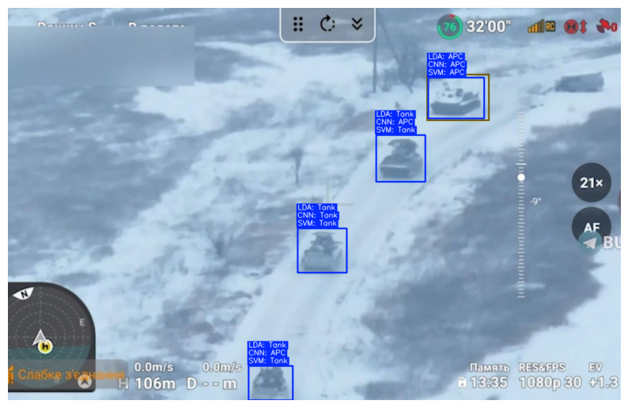

# Military Vehicle Classification

This project is a simple classification of military vehicles using SVM, LDA and CNN models.

[](./demo.png)

## Dataset

1. `data/*` contains the dataset of images of APCs and Tanks from the Oryx losses report during the Russo-Ukrainian War. Folder contains 850+ files of images.

2. `data.csv` contains the annotations for the dataset manually labeled in Label Studio.

   Structure:

   ```
   id,image_path,label,x,y,width,height
   ```

   - id - unique identifier for the image
   - image_path - path to the image
   - label - label of the image [APC, TANK]
   - x, y - bounding box coordinates
   - width, height - bounding box dimensions

3. `demo.csv` contains the object frames of military vehicles used to demonstrate classification results.

## Jupyter Notebook

`run.ipynb` contains the code for the project.

It includes:

- Data loading
- Feature extraction
- Model training
- Clustering visualization
- Performance metrics

